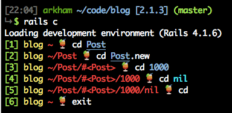
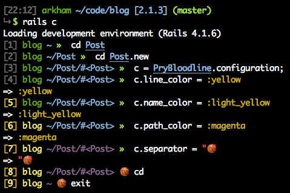

# Pry Bloodline

A glorious descendant of a noble lineage of status lines, to be used with Pry.

It turns this:


Into this:


## Themes

It's really easy to build your own theme!

### Freedom

```ruby
PryBloodline.configure do |c|
  c.line_color = :white
  c.name_color = :blue
  c.path_color = :red
  c.separator = "★"
  c.separator_color = :white
end
```


### Blood

```ruby
PryBloodline.configure do |c|
  c.line_color = :light_white
  c.name_color = :light_red
  c.path_color = :red
  c.separator_color = :light_black
end
```


### Thor

```ruby
PryBloodline.configure do |c|
  c.line_color = :red
  c.name_color = :white
  c.path_color = :blue
  c.separator = "⚡"
end
```


### Tropicana

```ruby
PryBloodline.configure do |c|
  c.line_color = :light_green
  c.name_color = :light_yellow
  c.path_color = :light_red
  c.separator = "🍹"
end
```



## Installation

Add this line to your application's Gemfile:

```ruby
group :development, :test do
  gem 'pry-bloodline'
end
```

And then execute:

    $ bundle

Or install it yourself as:

    $ gem install pry-bloodline

## Usage

Just run:

    $ rails console

Or if you want to use it as your default pry shell, create a `.pryrc` file in your home folder:

```ruby
require 'pry-bloodline'

PryBloodline.setup!
```

Then:

    $ pry

## Configuration

Here are all the fields you can configure:

```ruby
PryBloodline.configure do |c|
  c.name = "pry"
  c.line_color = :light_black
  c.name_color = :green
  c.path_color = :light_blue
  c.separator = "\u00BB"
  c.separator_color = :light_green
  c.name_proc = -> { c.name.colorize(c.name_color) }
  c.line_proc = ->(obj, level, pry) { "[#{pry.input_array.size}]".colorize(c.line_color) }
  c.path_proc = ->(obj, level, pry) { "(#{Pry.view_clip(obj)})".colorize(c.path_color) }
  c.separator_proc = -> { c.separator.colorize(c.separator_color) }
end
```

This configuration yields this theme:


Also you can try out things **live**:



Check the source code for more details on this ;)

## Troubleshooting

**I can't see the colors!!**

Make sure your ruby is compiled with readline support. RVM should enable this by
default, while for rbenv you can run:

```bash
brew install readline
RUBY_CONFIGURE_OPTS=--with-readline-dir="$(brew --prefix readline)" rbenv install 2.1.3
```

## Contributing

1. Fork it ( https://github.com/Arkham/pry-bloodline/fork )
2. Create your feature branch (`git checkout -b my-new-feature`)
3. Commit your changes (`git commit -am 'Add some feature'`)
4. Push to the branch (`git push origin my-new-feature`)
5. Create a new Pull Request
